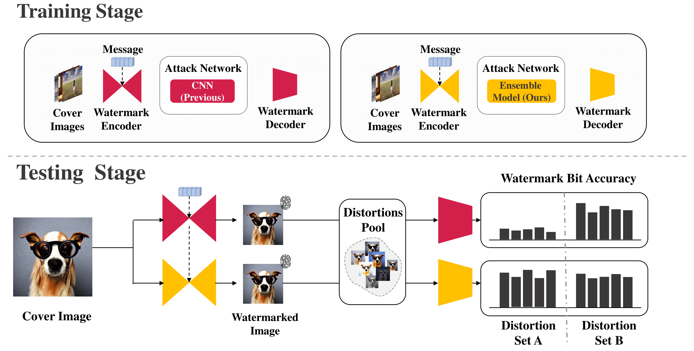

# Enhancing Robustness in Post-Processing Watermarking: An Ensemble Attack Network Using CNNs and Transformers

Workshop on AISec in ACM CCS 2025

#### [Paper](https://arxiv.org/pdf/2509.03006) | [arXiv](https://arxiv.org/abs/2509.03006)
<!--  -->
Tzuhsuan Huang*,
Cheng Yu Yeo*,
Tsai-Ling Huang,
[Hong-Han Shuai](https://basiclab.lab.nycu.edu.tw/),
[Wen-Huang Cheng](https://www.csie.ntu.edu.tw/~wenhuang/),
[Jun-Cheng Chen](https://www.citi.sinica.edu.tw/pages/pullpull/)

## Dataset
To download COCO Dataset, please refer to the [script](https://gist.github.com/mkocabas/a6177fc00315403d31572e17700d7fd9).

To download CelebA Dataset, please refer to this [link](https://mmlab.ie.cuhk.edu.hk/projects/CelebA.html).

```
Datasets/
└── coco/
    ├── train/
    |   └── train_class
    ├── test/
    |   └── test_class
    └── val/
        └── val_class
└── celeba/
    ├── train/
    |   └── train_class
    └── test/
        └── test_class
```

## HiDDeN
Details for training and testing are provided at [README](./HiDDeN/README.md).
## StegaStamp
Details for training and testing are provided at [README](./StegaStamp/README.md).